# 🔍 Interpretable_ML - Model Interpretability

## Overview
This module focuses on understanding and explaining machine learning models through various interpretability techniques. Learn to make black-box models transparent and build trust in AI systems.

## 📊 Module Structure

```mermaid
graph TD
    A[Interpretable_ML] --> B[Interpretable_ML_BreastCancer_Data.ipynb]
    A --> C[ShapleyValues_Classification.ipynb]
    A --> D[ShapleyValues_Regression.ipynb]
    
    B --> B1[🏥 Medical Data Interpretability]
    B --> B2[Healthcare Decision Support]
    B --> B3[Feature Importance Analysis]
    B --> B4[Clinical Insights]
    
    C --> C1[🎯 Classification Explanations]
    C --> C2[SHAP Values for Classes]
    C --> C3[Feature Contribution Analysis]
    C --> C4[Decision Boundaries]
    
    D --> D1[📈 Regression Explanations]
    D --> D2[SHAP Values for Predictions]
    D --> D3[Feature Impact Analysis]
    D --> D4[Continuous Predictions]
    
    B --> B5[Interpretation Techniques]
    B5 --> B6[Feature Importance]
    B5 --> B7[Partial Dependence]
    B5 --> B8[LIME Analysis]
    B5 --> B9[Medical Validation]
    
    C --> C5[SHAP Framework]
    C5 --> C6[Global Explanations]
    C5 --> C7[Local Explanations]
    C5 --> C8[Interaction Effects]
    C5 --> C9[Visualization Tools]
    
    D --> D5[Regression Insights]
    D5 --> D6[Feature Contributions]
    D5 --> D7[Prediction Decomposition]
    D5 --> D8[Sensitivity Analysis]
    D5 --> D9[Model Validation]
    
    style A fill:#e1f5fe
    style B fill:#f3e5f5
    style C fill:#e8f5e8
    style D fill:#fff3e0
```



## 🎯 Learning Objectives
- **Model Interpretability**: Understand why models make predictions
- **SHAP Values**: Master Shapley Additive Explanations
- **Feature Importance**: Identify most influential features
- **Local vs Global**: Explain individual predictions and overall behavior
- **Visualization**: Create intuitive explanation plots
- **Trust & Transparency**: Build confidence in AI systems
- **Bias Detection**: Identify and mitigate model biases

## 📁 Project Details

### 🏥 Interpretable_ML_BreastCancer_Data.ipynb
**Domain**: Healthcare & Medical AI
**Objective**: Explain medical diagnosis model decisions
**Dataset**: Breast cancer diagnostic data
**Importance**: Critical for medical decision support

**Key Features**:
- **Medical Relevance**: Real healthcare applications
- **Feature Analysis**: Understand diagnostic indicators
- **Clinical Validation**: Align with medical knowledge
- **Decision Support**: Aid healthcare professionals

**Interpretability Techniques**:
- Feature importance rankings
- Partial dependence plots
- LIME (Local Interpretable Model-agnostic Explanations)
- Correlation analysis
- Medical feature validation

### 🎯 ShapleyValues_Classification.ipynb
**Domain**: Classification Model Explanation
**Objective**: Explain classification decisions using SHAP values
**Technique**: Shapley Additive Explanations
**Application**: Any classification problem

**Key Concepts**:
- **Global Explanations**: Overall model behavior
- **Local Explanations**: Individual prediction explanations
- **Feature Contributions**: How each feature affects predictions
- **Interaction Effects**: Feature combinations impact

**SHAP Techniques**:
- TreeExplainer for tree-based models
- LinearExplainer for linear models
- KernelExplainer for any model
- DeepExplainer for neural networks

### 📈 ShapleyValues_Regression.ipynb
**Domain**: Regression Model Explanation
**Objective**: Explain continuous predictions using SHAP values
**Technique**: Shapley values for regression
**Application**: Any regression problem

**Key Concepts**:
- **Prediction Decomposition**: Break down predictions into feature contributions
- **Feature Impact**: Quantify each feature's effect on output
- **Baseline Comparison**: Compare against average prediction
- **Sensitivity Analysis**: Understand feature sensitivity

**Regression-Specific Insights**:
- Continuous feature effects
- Non-linear relationship explanations
- Feature interaction quantification
- Prediction confidence intervals

## 🔬 Interpretability Techniques

### 🎯 SHAP (SHapley Additive exPlanations)
- **Unified Framework**: Consistent explanation method
- **Game Theory**: Based on cooperative game theory
- **Additive**: Feature contributions sum to prediction
- **Efficient**: Fast computation for various models

### 🔍 LIME (Local Interpretable Model-agnostic Explanations)
- **Local Explanations**: Focus on individual predictions
- **Model-Agnostic**: Works with any model
- **Interpretable Models**: Use simple models for explanation
- **Perturbation-Based**: Vary inputs to understand behavior

### 📊 Feature Importance
- **Permutation Importance**: Feature shuffling impact
- **Built-in Importance**: Tree-based model importance
- **Coefficient Analysis**: Linear model coefficients
- **Gradient-Based**: Neural network gradients

### 📈 Partial Dependence Plots
- **Marginal Effects**: Feature impact while averaging others
- **Non-linear Relationships**: Visualize complex patterns
- **Interaction Plots**: Two-feature interactions
- **Ice Plots**: Individual conditional expectations

## 🛠️ Tools & Libraries

- **SHAP**: Primary interpretability library
- **LIME**: Local explanation framework
- **ELI5**: Explain Like I'm 5 library
- **Scikit-learn**: Built-in interpretability tools
- **Matplotlib/Seaborn**: Visualization
- **Plotly**: Interactive explanations

## 🚀 Getting Started

1. **Launch Jupyter Lab**:
   ```bash
   jupyter lab
   ```
2. **Start with medical data** for real-world relevance
3. **Explore SHAP classification** for categorical outcomes
4. **Examine SHAP regression** for continuous predictions
5. **Compare different explanation methods**

## 💡 Best Practices Demonstrated

### 🔧 Explanation Quality
- **Consistency**: Use standardized explanation methods
- **Comprehensiveness**: Multiple explanation techniques
- **Validation**: Cross-check explanations with domain knowledge
- **Visualization**: Clear, intuitive explanation plots

### 📈 Model Validation
- **Sanity Checks**: Verify explanations make sense
- **Domain Expertise**: Validate with subject matter experts
- **Bias Detection**: Identify unfair or biased patterns
- **Robustness**: Test explanation stability

### 🎯 Communication
- **Stakeholder-Specific**: Tailor explanations to audience
- **Visual Clarity**: Use appropriate visualization techniques
- **Actionable Insights**: Provide interpretable recommendations
- **Trust Building**: Transparent AI decision-making

## 📈 Workflow Process

1. **Model Training**: Build accurate predictive models
2. **Explanation Generation**: Apply interpretability techniques
3. **Validation**: Verify explanations with domain knowledge
4. **Visualization**: Create clear explanation plots
5. **Documentation**: Document interpretation insights
6. **Stakeholder Review**: Present findings to relevant parties
7. **Bias Assessment**: Check for unfair patterns
8. **Deployment**: Implement explainable AI system

## 🔍 Key Applications

### 🏥 Healthcare
- **Diagnosis Support**: Explain medical predictions
- **Treatment Recommendations**: Justify therapy choices
- **Risk Assessment**: Understand patient risk factors
- **Regulatory Compliance**: Meet medical AI standards

### 💼 Finance
- **Credit Scoring**: Explain loan decisions
- **Risk Management**: Understand risk factors
- **Fraud Detection**: Justify suspicious activity flags
- **Investment Decisions**: Explain portfolio choices

### ⚖️ Legal & Regulatory
- **Fair Lending**: Ensure unbiased decisions
- **GDPR Compliance**: Right to explanation
- **Audit Trails**: Document decision processes
- **Bias Mitigation**: Identify and address unfairness

## 📊 Evaluation Metrics

### 🎯 Explanation Quality
- **Faithfulness**: How well explanations represent model behavior
- **Consistency**: Stable explanations across similar inputs
- **Completeness**: Comprehensive coverage of model behavior
- **Plausibility**: Alignment with domain knowledge

### 📈 Trust Metrics
- **User Comprehension**: How well users understand explanations
- **Decision Support**: Improvement in user decision-making
- **Confidence**: User trust in AI system
- **Adoption**: System usage and acceptance

## 🌟 Key Benefits

### 🔍 Transparency
- **Decision Transparency**: Clear understanding of AI decisions
- **Process Visibility**: See how models work
- **Accountability**: Responsibility for AI outcomes
- **Auditability**: Traceable decision processes

### 🎯 Trust & Adoption
- **User Confidence**: Trust in AI systems
- **Stakeholder Buy-in**: Acceptance by decision-makers
- **Regulatory Compliance**: Meet explainability requirements
- **Bias Detection**: Identify and mitigate unfairness

### 📈 Model Improvement
- **Debug Models**: Identify model weaknesses
- **Feature Engineering**: Insights for better features
- **Data Quality**: Detect data issues
- **Model Selection**: Choose interpretable models

---
