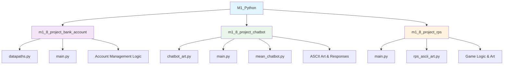

# 🐍 M1_Python - Python Fundamentals & Basic Projects

## Overview
This module introduces Python programming fundamentals through practical projects that build core programming skills essential for data science and machine learning.

## 📊 Module Structure



## 🎯 Learning Objectives
- **Object-Oriented Programming**: Classes, methods, and encapsulation
- **File I/O Operations**: Reading and writing data
- **User Input Handling**: Interactive command-line applications
- **Control Flow**: Loops, conditionals, and error handling
- **String Manipulation**: Text processing and formatting
- **Code Organization**: Modular programming with multiple files

## 📁 Project Details

### 🏦 Bank Account Management System
**Files**: `datapaths.py`, `main.py`
- **Concepts**: Class design, file persistence, account operations
- **Features**: Account creation, deposits, withdrawals, balance checking
- **Skills**: Object-oriented programming, data validation, file handling

### 🤖 Interactive Chatbot
**Files**: `chatbot_art.py`, `main.py`, `mean_chatbot.py`
- **Concepts**: String processing, conditional responses, ASCII art
- **Features**: Interactive conversation, personality responses, visual elements
- **Skills**: String manipulation, user interaction, creative programming

### 🎮 Rock Paper Scissors Game
**Files**: `main.py`, `rps_ascii_art.py`
- **Concepts**: Game logic, random selection, score tracking
- **Features**: Player vs computer, visual feedback, game statistics
- **Skills**: Logic implementation, random number generation, game design

## 🚀 Getting Started

1. **Navigate to any project directory**
2. **Run the main.py file**:
   ```bash
   python main.py
   ```
3. **Follow the interactive prompts**

## 💡 Key Programming Concepts Covered

- **Classes and Objects**: Building reusable code structures
- **Methods and Functions**: Organizing code logic
- **File Operations**: Persistent data storage
- **Error Handling**: Robust program design
- **User Interface**: Command-line interaction design
- **Code Documentation**: Writing clear, maintainable code

## 🔧 Technical Requirements

- Python 3.10+
- Basic understanding of command-line operations
- Text editor or IDE
