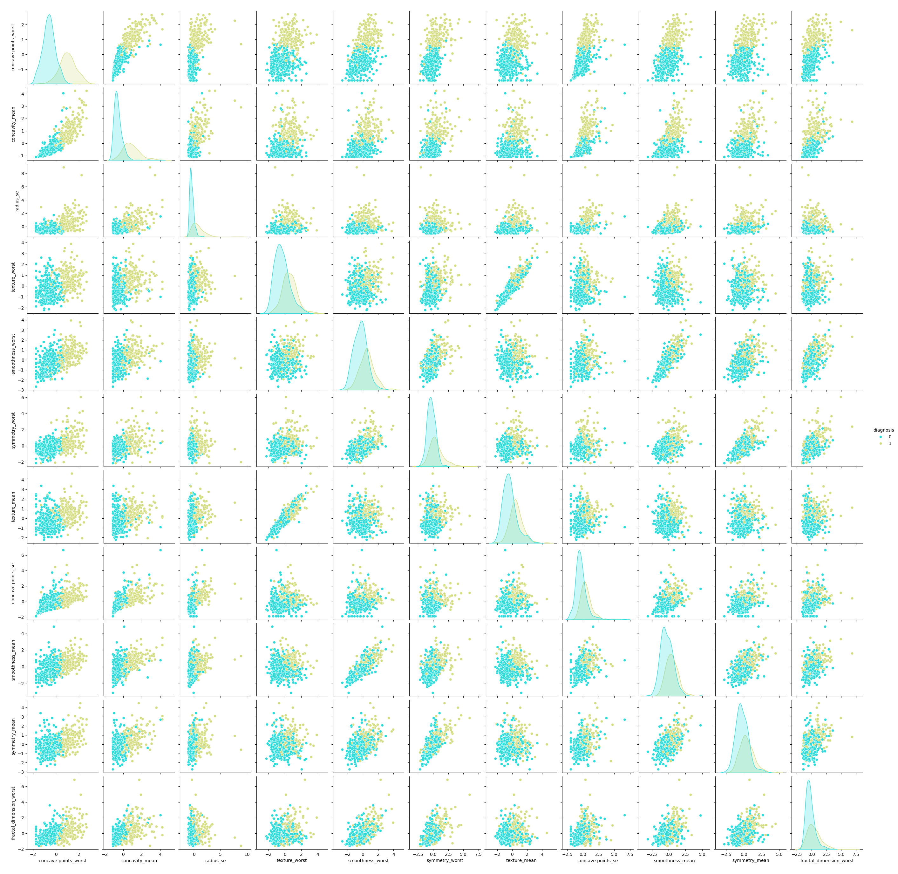

# 📊 M2_DataAnalysis - Data Analysis & Visualization

## Overview
This module focuses on exploratory data analysis (EDA), data visualization, and statistical analysis using real-world datasets. Learn to extract insights from data and create compelling visualizations.

## 📊 Module Structure


## 🎯 Learning Objectives
- **Data Cleaning**: Handle missing values, outliers, and data quality issues
- **Exploratory Data Analysis**: Discover patterns and relationships in data
- **Statistical Analysis**: Descriptive statistics and hypothesis testing
- **Data Visualization**: Create informative plots and charts
- **Feature Engineering**: Transform and create new features
- **Correlation Analysis**: Understand relationships between variables

## 📁 Project Details

### 🍫 Chocolate Quality Analysis
**File**: `Module2_Miniproject_1_Chocolate.ipynb`
**Dataset**: `flavors_of_cacao.csv`
- **Concepts**: Data quality assessment, categorical analysis, rating systems
- **Techniques**: Distribution analysis, correlation matrices, category comparisons
- **Insights**: Factors affecting chocolate quality and ratings

### ⚽ Football Statistics Analysis
**File**: `Module2_Miniproject_2_Football.ipynb`
**Dataset**: `data.csv`
- **Concepts**: Sports analytics, performance metrics, trend analysis
- **Techniques**: Time series analysis, player/team comparisons, statistical modeling
- **Insights**: Performance patterns and predictive indicators

### 🏥 Breast Cancer Data Analysis
**File**: `Module2_Miniproject_3_BreastCancer.ipynb`
**Dataset**: Medical dataset
- **Concepts**: Medical data analysis, feature selection, classification preparation
- **Techniques**: Feature correlation, dimensionality reduction, medical statistics
- **Outputs**: Feature pair plots, violin plots for medical insights

### Breast Cancer Dataset - Selected Features Violin Plots:


### Breast Cancer Dataset - Selected Features Pair Plot:


### 🏦 Banking Customer Analysis
**Dataset**: `TheraBank.csv`
- **Concepts**: Customer segmentation, financial behavior analysis
- **Techniques**: Customer profiling, risk assessment, behavioral patterns
- **Applications**: Marketing strategies, risk management

## 📈 Key Visualizations Generated

- **Pair Plots**: Multi-dimensional feature relationships
- **Violin Plots**: Distribution shapes and statistical summaries
- **Correlation Matrices**: Feature interdependencies
- **Statistical Summaries**: Descriptive analytics

## 🛠️ Tools & Libraries Used

- **Pandas**: Data manipulation and analysis
- **NumPy**: Numerical computing
- **Matplotlib**: Basic plotting and visualization
- **Seaborn**: Statistical data visualization
- **Scipy**: Statistical analysis
- **Jupyter**: Interactive development environment

## 🚀 Getting Started

1. **Launch Jupyter Lab**:
   ```bash
   jupyter lab
   ```
2. **Open any notebook file**
3. **Execute cells sequentially**
4. **Explore the generated visualizations**

## 💡 Key Data Science Concepts

- **Data Profiling**: Understanding dataset characteristics
- **Missing Data Handling**: Imputation strategies
- **Outlier Detection**: Identifying and handling anomalies
- **Feature Selection**: Choosing relevant variables
- **Statistical Testing**: Hypothesis validation
- **Visualization Best Practices**: Effective communication through charts

## 📊 Analysis Workflow

1. **Data Import & Inspection**
2. **Data Cleaning & Preprocessing**
3. **Exploratory Data Analysis**
4. **Statistical Analysis**
5. **Visualization Creation**
6. **Insight Generation**
7. **Report & Documentation**
