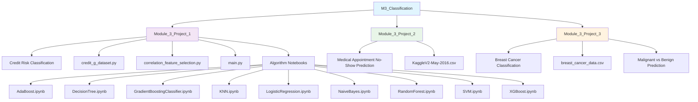

# 🎯 M3_Classification - Classification Algorithms

## Overview
This module explores various classification algorithms and techniques, applying them to real-world datasets to predict categorical outcomes. Learn to build, evaluate, and compare different classification models.

## 📊 Module Structure



## 🎯 Learning Objectives
- **Classification Algorithms**: Master multiple classification techniques
- **Model Evaluation**: Accuracy, precision, recall, F1-score, ROC-AUC
- **Feature Selection**: Identify most important predictive features
- **Model Comparison**: Compare performance across different algorithms
- **Hyperparameter Tuning**: Optimize model parameters
- **Cross-Validation**: Robust model evaluation techniques

## 📁 Project Details

### 💳 Module_3_Project_1: Credit Risk Classification
**Domain**: Financial Risk Assessment
**Dataset**: German Credit Dataset
**Objective**: Predict credit risk (good/bad) based on customer attributes

**Files**:
- `credit_g_dataset.py`: Dataset handling and preprocessing
- `correlation_feature_selection.py`: Feature selection utilities
- `main.py`: Main execution script
- Multiple algorithm notebooks for comparison

**Algorithms Implemented**:
- **Decision Tree**: Interpretable tree-based decisions
- **Random Forest**: Ensemble of decision trees
- **Logistic Regression**: Linear probabilistic classifier
- **SVM**: Support Vector Machine for complex boundaries
- **K-Nearest Neighbors**: Instance-based learning
- **Naive Bayes**: Probabilistic classifier
- **AdaBoost**: Adaptive boosting ensemble
- **Gradient Boosting**: Advanced ensemble method
- **XGBoost**: Extreme gradient boosting

### 🏥 Module_3_Project_2: Medical Appointment No-Show Prediction
**Domain**: Healthcare Analytics
**Dataset**: `KaggleV2-May-2016.csv`
**Objective**: Predict whether patients will show up for their medical appointments

**Key Features**:
- Patient demographics
- Appointment scheduling details
- Medical history indicators
- Social factors

**Applications**:
- Healthcare resource optimization
- Appointment scheduling efficiency
- Patient engagement strategies

### 🩺 Module_3_Project_3: Breast Cancer Classification
**Domain**: Medical Diagnosis
**Dataset**: `breast_cancer_data.csv`
**Objective**: Classify breast cancer cases as malignant or benign

**Features**:
- Breast examination measurements
- Cell nucleus characteristics
- Tumor properties

**Clinical Impact**:
- Early detection support
- Diagnostic assistance
- Treatment planning

## 🔬 Classification Algorithms Covered

### 🌳 Tree-Based Methods
- **Decision Tree**: Simple, interpretable rules
- **Random Forest**: Bagging ensemble method
- **Gradient Boosting**: Sequential error correction
- **XGBoost**: Optimized gradient boosting

### 📊 Linear Methods
- **Logistic Regression**: Linear decision boundaries
- **SVM**: Maximum margin classification

### 🎯 Instance-Based
- **K-Nearest Neighbors**: Local similarity-based decisions

### 📈 Probabilistic
- **Naive Bayes**: Feature independence assumption

### 🚀 Ensemble Methods
- **AdaBoost**: Adaptive boosting
- **Gradient Boosting**: Advanced ensemble technique

## 📊 Model Evaluation Metrics

- **Accuracy**: Overall correctness
- **Precision**: Positive prediction reliability
- **Recall**: Sensitivity to positive cases
- **F1-Score**: Harmonic mean of precision and recall
- **ROC-AUC**: Area under the ROC curve
- **Confusion Matrix**: Detailed prediction breakdown
- **Classification Report**: Comprehensive metrics summary

## 🛠️ Tools & Libraries

- **Scikit-learn**: Primary machine learning library
- **Pandas**: Data manipulation
- **NumPy**: Numerical computing
- **Matplotlib/Seaborn**: Visualization
- **XGBoost**: Advanced gradient boosting
- **Imbalanced-learn**: Handling class imbalance

## 🚀 Getting Started

1. **Navigate to any project directory**
2. **Launch Jupyter Lab**:
   ```bash
   jupyter lab
   ```
3. **Open algorithm notebooks** for detailed implementations
4. **Run `main.py`** for comprehensive comparisons
5. **Analyze results** and model performance

## 💡 Best Practices Demonstrated

- **Data Preprocessing**: Scaling, encoding, missing value handling
- **Feature Engineering**: Selection and transformation
- **Model Validation**: Cross-validation and hold-out testing
- **Hyperparameter Tuning**: Grid search and random search
- **Performance Comparison**: Systematic algorithm evaluation
- **Interpretability**: Feature importance analysis

## 📈 Workflow Process

1. **Data Exploration**: Understand dataset characteristics
2. **Preprocessing**: Clean and prepare data
3. **Feature Selection**: Choose relevant predictors
4. **Model Training**: Fit multiple algorithms
5. **Evaluation**: Compare model performance
6. **Optimization**: Tune hyperparameters
7. **Validation**: Test on unseen data
8. **Interpretation**: Understand model decisions
