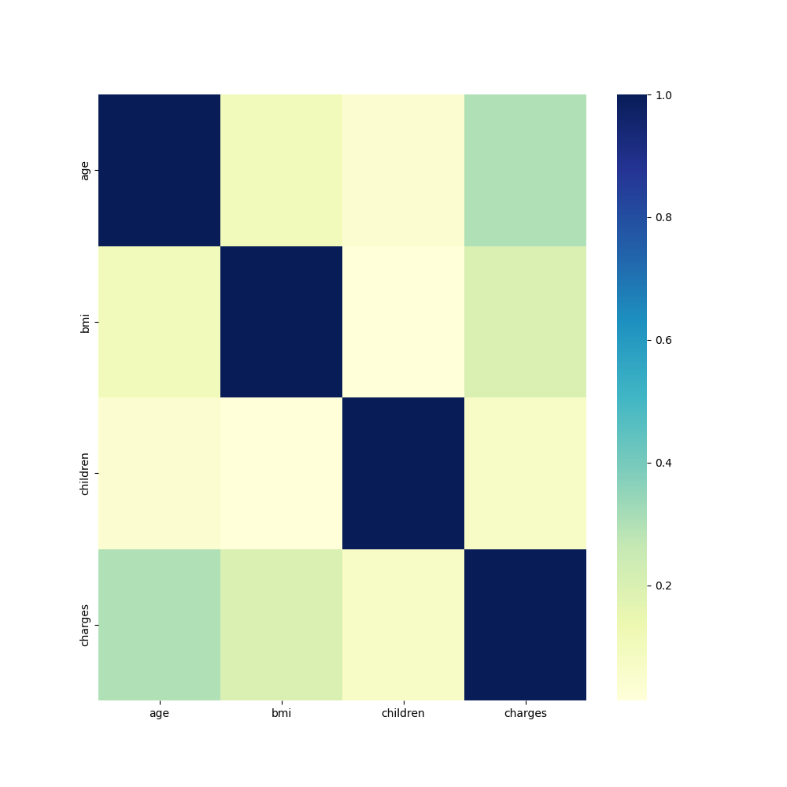
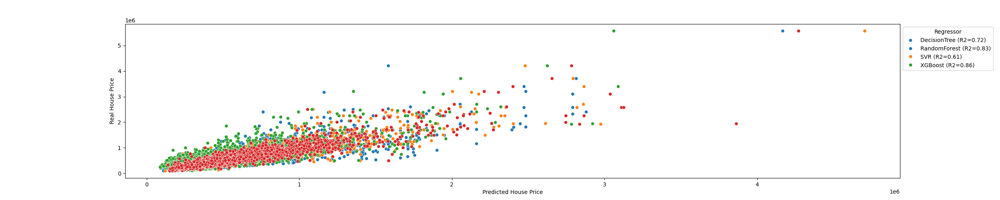

# 📈 M4_Regression - Regression Models

## Overview
This module explores various regression algorithms and techniques for predicting continuous numerical values. Learn to build, evaluate, and compare different regression models across diverse domains.

## 📊 Module Structure

```mermaid
graph TD
    A[M4_Regression] --> B[Module_4_Project_1]
    A --> C[Module_4_Project_2]
    A --> D[Module_4_Project_3]
    A --> E[Module_4_Project_4]
    
    B --> B1[🥑 Avocado Price Prediction]
    B --> B2[KNN & XGBoost Models]
    B --> B3[Price Forecasting]
    
    C --> C1[📦 Product Demand Forecasting]
    C --> C2[Category-based Analysis]
    C --> C3[Individual Product Forecasts]
    
    D --> D1[🏥 Health Insurance Premiums]
    D --> D2[Feature Correlation Analysis]
    D --> D3[Cost Prediction Models]
    
    E --> E1[🏠 Housing Price Prediction]
    E --> E2[Comprehensive Feature Analysis]
    E --> E3[Real vs Predicted Comparison]
    
    B --> B4[Visualizations]
    B4 --> B5[KNN Predictions]
    B4 --> B6[XGBoost Results]
    
    C --> C4[Forecast Charts]
    C4 --> C5[Category Forecasts]
    C4 --> C6[Product-level Forecasts]
    
    D --> D4[Analysis Plots]
    D4 --> D7[Correlation Matrices]
    D4 --> D8[BoxPlots & ViolinPlots]
    
    E --> E4[Feature Relationships]
    E4 --> E5[Numerical Features]
    E4 --> E6[Ordinal Features]
    E4 --> E7[Categorical Features]
    E4 --> E8[Prediction Accuracy]
    
    style A fill:#e1f5fe
    style B fill:#f3e5f5
    style C fill:#e8f5e8
    style D fill:#fff3e0
    style E fill:#f3e5f5
```



## 🎯 Learning Objectives
- **Regression Algorithms**: Master multiple regression techniques
- **Model Evaluation**: RMSE, MAE, R², adjusted R²
- **Feature Engineering**: Transform and create predictive features
- **Time Series Analysis**: Forecasting future values
- **Model Comparison**: Compare performance across algorithms
- **Hyperparameter Tuning**: Optimize model parameters

## 📁 Project Details

### 🥑 Module_4_Project_1: Avocado Price Prediction
**Domain**: Agricultural Economics
**Objective**: Predict avocado prices based on market factors

**Key Features**:
- Seasonal patterns
- Regional variations
- Volume and supply factors
- Market dynamics

**Models Implemented**:
- **K-Nearest Neighbors (KNN)**: Local similarity-based predictions
- **XGBoost**: Advanced gradient boosting for complex patterns


### 📦 Module_4_Project_2: Product Demand Forecasting
**Domain**: Supply Chain & Inventory Management
**Objective**: Forecast product demand for better inventory planning

**Analysis Levels**:
- **Category-level**: Aggregate demand by product categories
- **Product-level**: Individual product demand patterns

**Applications**:
- Inventory optimization
- Supply chain planning
- Revenue forecasting


### 🏥 Module_4_Project_3: Health Insurance Premium Prediction
**Domain**: Healthcare Finance
**Objective**: Predict insurance costs based on customer attributes

**Feature Analysis**:
- **Numerical Features**: Age, BMI, number of dependents
- **Categorical Features**: Gender, smoking status, region

**Comprehensive Visualizations**:
- Correlation analysis between numerical features and costs
- Box plots showing categorical feature relationships
- Violin plots for distribution analysis




### 🏠 Module_4_Project_4: Housing Price Prediction
**Domain**: Real Estate
**Objective**: Predict house prices using comprehensive property features

**Feature Categories**:
- **Numerical Features**: Square footage, lot size, age
- **Ordinal Features**: Quality ratings, condition scores
- **Categorical Features**: Neighborhood, property type, amenities

**Advanced Analysis**:
- Multi-dimensional feature relationships
- Prediction accuracy visualization
- Real vs predicted price comparisons




## 🔬 Regression Algorithms Covered

### 🌳 Tree-Based Methods
- **Random Forest**: Ensemble of decision trees
- **Gradient Boosting**: Sequential error correction
- **XGBoost**: Optimized gradient boosting

### 📊 Linear Methods
- **Linear Regression**: Simple linear relationships
- **Ridge Regression**: L2 regularization
- **Lasso Regression**: L1 regularization
- **Elastic Net**: Combined L1/L2 regularization

### 🎯 Distance-Based
- **K-Nearest Neighbors**: Local similarity predictions
- **Support Vector Regression**: Maximum margin regression

### 🧠 Advanced Methods
- **Neural Networks**: Deep learning approaches
- **Polynomial Regression**: Non-linear relationships

## 📊 Model Evaluation Metrics

- **RMSE**: Root Mean Square Error
- **MAE**: Mean Absolute Error
- **R²**: Coefficient of Determination
- **Adjusted R²**: Adjusted for number of features
- **MAPE**: Mean Absolute Percentage Error
- **Residual Analysis**: Error pattern investigation

## 🛠️ Tools & Libraries

- **Scikit-learn**: Primary machine learning library
- **XGBoost**: Advanced gradient boosting
- **Pandas**: Data manipulation
- **NumPy**: Numerical computing
- **Matplotlib/Seaborn**: Visualization
- **Statsmodels**: Statistical modeling

## 🚀 Getting Started

1. **Navigate to any project directory**
2. **Launch Jupyter Lab**:
   ```bash
   jupyter lab
   ```
3. **Open project notebooks** for detailed implementations
4. **Explore visualizations** to understand data patterns
5. **Compare model performances** across different algorithms

## 💡 Best Practices Demonstrated

- **Feature Engineering**: Creating predictive features
- **Data Preprocessing**: Scaling, encoding, outlier handling
- **Model Validation**: Cross-validation and hold-out testing
- **Hyperparameter Tuning**: Grid search optimization
- **Residual Analysis**: Understanding model errors
- **Feature Importance**: Identifying key predictors

## 📈 Workflow Process

1. **Data Exploration**: Understand target variable distribution
2. **Feature Analysis**: Examine relationships with target
3. **Preprocessing**: Clean and prepare data
4. **Model Selection**: Choose appropriate algorithms
5. **Training**: Fit models to training data
6. **Evaluation**: Assess model performance
7. **Optimization**: Tune hyperparameters
8. **Validation**: Test on unseen data
9. **Interpretation**: Understand predictions
