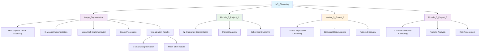

# 🎨 M5_Clustering - Clustering Techniques

## Overview
This module explores unsupervised learning through clustering algorithms, focusing on discovering hidden patterns and structures in data without labeled examples.

## 📊 Module Structure



## 🎯 Learning Objectives
- **Unsupervised Learning**: Discover patterns without labeled data
- **Clustering Algorithms**: Master various clustering techniques
- **Cluster Evaluation**: Silhouette score, inertia, Davies-Bouldin index
- **Dimensionality Reduction**: PCA, t-SNE for visualization
- **Feature Engineering**: Preprocessing for clustering
- **Domain Applications**: Apply clustering across different domains

## 📁 Project Details

### 🖼️ Image_Segmentation: Computer Vision Clustering
**Domain**: Computer Vision & Image Processing
**Objective**: Segment images into meaningful regions using clustering

**Techniques Implemented**:
- **K-Means Clustering**: Partition pixels into k clusters
- **Mean-Shift Clustering**: Density-based segmentation

**Applications**:
- Object detection preprocessing
- Medical image analysis
- Artistic image processing
- Background removal

**Visual Results**:


### 📊 Module_5_Project_1: Customer Segmentation
**Domain**: Marketing & Business Analytics
**Objective**: Identify distinct customer groups for targeted marketing

**Key Features**:
- Purchase behavior
- Demographics
- Engagement metrics
- Loyalty indicators

**Business Applications**:
- Personalized marketing campaigns
- Product recommendations
- Customer retention strategies
- Market research insights

### 🧬 Module_5_Project_2: Gene Expression Analysis
**Domain**: Bioinformatics & Genomics
**Objective**: Cluster genes based on expression patterns

**Analysis Focus**:
- Gene expression profiles
- Pathway analysis
- Disease classification
- Drug discovery support

**Scientific Impact**:
- Biomarker identification
- Treatment personalization
- Disease understanding
- Research hypothesis generation

### 📈 Module_5_Project_3: Financial Market Clustering
**Domain**: Finance & Investment
**Objective**: Group financial instruments based on behavior patterns

**Applications**:
- Portfolio diversification
- Risk assessment
- Market regime identification
- Investment strategy development

## 🔬 Clustering Algorithms Covered

### 🎯 Centroid-Based
- **K-Means**: Partition data into k clusters
- **K-Medoids**: Robust centroid-based clustering
- **Mini-Batch K-Means**: Scalable K-means variant

### 🌊 Density-Based
- **DBSCAN**: Density-based spatial clustering
- **Mean-Shift**: Mode-seeking algorithm
- **OPTICS**: Ordering points clustering

### 📊 Hierarchical
- **Agglomerative**: Bottom-up hierarchy building
- **Divisive**: Top-down cluster splitting
- **Dendrogram Analysis**: Tree-based visualization

### 🧠 Advanced Methods
- **Gaussian Mixture Models**: Probabilistic clustering
- **Spectral Clustering**: Graph-based clustering
- **Affinity Propagation**: Exemplar-based clustering

## 📊 Cluster Evaluation Metrics

- **Silhouette Score**: Cluster cohesion and separation
- **Inertia**: Within-cluster sum of squares
- **Davies-Bouldin Index**: Cluster validity measure
- **Calinski-Harabasz Index**: Cluster separation ratio
- **Adjusted Rand Index**: Clustering agreement measure
- **Homogeneity & Completeness**: Cluster purity measures

## 🛠️ Tools & Libraries

- **Scikit-learn**: Primary clustering algorithms
- **OpenCV**: Image processing for computer vision
- **Pandas**: Data manipulation
- **NumPy**: Numerical computing
- **Matplotlib/Seaborn**: Visualization
- **Plotly**: Interactive visualizations

## 🚀 Getting Started

1. **Navigate to any project directory**
2. **Launch Jupyter Lab**:
   ```bash
   jupyter lab
   ```
3. **Open project notebooks** for detailed implementations
4. **Explore clustering visualizations**
5. **Experiment with different algorithms**

## 💡 Best Practices Demonstrated

- **Data Preprocessing**: Scaling, normalization for clustering
- **Optimal Cluster Number**: Elbow method, silhouette analysis
- **Feature Selection**: Relevant features for clustering
- **Visualization**: 2D/3D cluster representation
- **Evaluation**: Multiple metrics for cluster quality
- **Interpretation**: Business meaning of discovered clusters

## 📈 Workflow Process

1. **Data Exploration**: Understand data structure and patterns
2. **Preprocessing**: Scale and prepare data for clustering
3. **Algorithm Selection**: Choose appropriate clustering method
4. **Parameter Tuning**: Optimize cluster parameters
5. **Clustering**: Apply algorithms to data
6. **Evaluation**: Assess cluster quality
7. **Visualization**: Create meaningful cluster representations
8. **Interpretation**: Extract business insights
9. **Validation**: Verify cluster stability and meaning

## 🎨 Visualization Techniques

- **2D/3D Scatter Plots**: Cluster visualization
- **Heatmaps**: Feature importance in clusters
- **Dendrograms**: Hierarchical cluster relationships
- **Silhouette Plots**: Cluster quality assessment
- **Parallel Coordinates**: Multi-dimensional cluster profiles

## 🌟 Key Insights

- **Pattern Discovery**: Uncover hidden data structures
- **Segmentation**: Natural groupings in data
- **Anomaly Detection**: Identify outliers and unusual patterns
- **Dimensionality Understanding**: Reduce complexity while preserving information
- **Business Intelligence**: Actionable insights from data groupings
