# 🎨 M5_Clustering - Clustering Techniques

## Overview
This module explores unsupervised learning through clustering algorithms, focusing on discovering hidden patterns and structures in data without labeled examples.

## 📊 Module Structure

```mermaid
graph TD
    A[M5_Clustering] --> B[Image_Segmentation]
    A --> C[Module_5_Project_1]
    A --> D[Module_5_Project_2]
    A --> E[Module_5_Project_3]
    A --> F[ScalpEEG_Brain_Heatmaps]
    
    B --> B1[🖼️ Computer Vision Clustering]
    B --> B2[K-Means Implementation]
    B --> B3[Mean-Shift Implementation]
    B --> B4[Image Processing]
    
    C --> C1[📊 Customer Segmentation]
    C --> C2[Market Analysis]
    C --> C3[Behavioral Clustering]
    
    D --> D1[🧬 Gene Expression Clustering]
    D --> D2[Biological Data Analysis]
    D --> D3[Pattern Discovery]
    
    E --> E1[📈 Financial Market Clustering]
    E --> E2[Portfolio Analysis]
    E --> E3[Risk Assessment]
    
    F --> F1[🧠 Brain Template Segmentation]
    F --> F2[HFO Activity Mapping]
    F --> F3[Developmental Analysis]
    F --> F4[Medical Imaging Clustering]
    
    B --> B5[Visualization Results]
    B5 --> B6[K-Means Segmentation]
    B5 --> B7[Mean-Shift Results]
    
    F --> F5[Neuroimaging Results]
    F5 --> F6[Brain Heatmaps]
    F5 --> F7[Age Group Analysis]
    
    style A fill:#e1f5fe
    style B fill:#f3e5f5
    style C fill:#e8f5e8
    style D fill:#fff3e0
    style E fill:#f3e5f5
    style F fill:#e8eaf6
```

## 🎯 Topics
- **Unsupervised Learning**: Discover patterns without labeled data
- **Clustering Algorithms**: Master various clustering techniques
- **Cluster Evaluation**: Silhouette score, inertia, Davies-Bouldin index
- **Dimensionality Reduction**: PCA, t-SNE for visualization
- **Feature Engineering**: Preprocessing for clustering
- **Domain Applications**: Apply clustering across different domains

## 📁 Projects

### 🧠 ScalpEEG Brain Heatmaps
Generation of Heatmaps using K-Means clustering for brain template segmentation and HFO activity visualization across developmental age groups.
**Key Features:**
- **Brain Template Segmentation**: K-Means clustering (k=4) for automatic removal of anatomical folds
- **Region Parcellation**: K-Means clustering (k=5) for anatomical lobe definition
- **HFO Activity Mapping**: Visualization of neural oscillation patterns across brain regions
- **Developmental Analysis**: Comparative study across 5 age groups (1 month - 17 years)
- **Interactive Visualization**: Animated heatmaps showing temporal changes

### 📊 Module_5_Project_1: Customer Segmentation
**Domain**: Marketing & Business Analytics
**Objective**: Identify distinct customer groups for targeted marketing

**Key Features**:
- Purchase behavior
- Demographics
- Engagement metrics
- Loyalty indicators

**Business Applications**:
- Personalized marketing campaigns
- Product recommendations
- Customer retention strategies
- Market research insights

### 🧬 Module_5_Project_2: Gene Expression Analysis
**Domain**: Bioinformatics & Genomics
**Objective**: Cluster genes based on expression patterns

**Analysis Focus**:
- Gene expression profiles
- Pathway analysis
- Disease classification
- Drug discovery support

**Scientific Impact**:
- Biomarker identification
- Treatment personalization
- Disease understanding
- Research hypothesis generation

### 📈 Module_5_Project_3: Financial Market Clustering
**Domain**: Finance & Investment
**Objective**: Group financial instruments based on behavior patterns

**Applications**:
- Portfolio diversification
- Risk assessment
- Market regime identification
- Investment strategy development

## 🔬 Clustering Algorithms Covered

### 🎯 Centroid-Based
- **K-Means**: Partition data into k clusters
- **K-Medoids**: Robust centroid-based clustering
- **Mini-Batch K-Means**: Scalable K-means variant

### 🌊 Density-Based
- **DBSCAN**: Density-based spatial clustering
- **Mean-Shift**: Mode-seeking algorithm
- **OPTICS**: Ordering points clustering

### 📊 Hierarchical
- **Agglomerative**: Bottom-up hierarchy building
- **Divisive**: Top-down cluster splitting
- **Dendrogram Analysis**: Tree-based visualization

### 🧠 Advanced Methods
- **Gaussian Mixture Models**: Probabilistic clustering
- **Spectral Clustering**: Graph-based clustering
- **Affinity Propagation**: Exemplar-based clustering

## 📊 Cluster Evaluation Metrics

- **Silhouette Score**: Cluster cohesion and separation
- **Inertia**: Within-cluster sum of squares
- **Davies-Bouldin Index**: Cluster validity measure
- **Calinski-Harabasz Index**: Cluster separation ratio
- **Adjusted Rand Index**: Clustering agreement measure
- **Homogeneity & Completeness**: Cluster purity measures
- **V-Measure**: Balance between homogeneity and completeness