# 🧠 M7_ANN - Artificial Neural Networks

## Overview
This module introduces artificial neural networks (ANNs), the foundation of deep learning. Learn to build, train, and optimize neural networks for both classification and regression tasks.

## 📊 Module Structure

```mermaid
graph TD
    A[M7_ANN] --> B[Module_7_ANN_Classification]
    A --> C[Module_7_ANN_Regression]
    
    B --> B1[🎯 Classification Networks]
    B --> B2[Multi-class Problems]
    B --> B3[Binary Classification]
    B --> B4[Performance Metrics]
    
    C --> C1[📈 Regression Networks]
    C --> C2[Continuous Predictions]
    C --> C3[Function Approximation]
    C --> C4[Error Minimization]
    
    B --> B5[Architecture Design]
    B5 --> B6[Input Layer]
    B5 --> B7[Hidden Layers]
    B5 --> B8[Output Layer]
    B5 --> B9[Activation Functions]
    
    C --> C5[Network Components]
    C5 --> C6[Feedforward Process]
    C5 --> C7[Backpropagation]
    C5 --> C8[Weight Updates]
    C5 --> C9[Gradient Descent]
    
    B --> B10[Training Process]
    B10 --> B11[Loss Functions]
    B10 --> B12[Optimization]
    B10 --> B13[Regularization]
    
    C --> C10[Model Evaluation]
    C10 --> C11[Validation]
    C10 --> C12[Testing]
    C10 --> C13[Hyperparameter Tuning]
    
    style A fill:#e1f5fe
    style B fill:#f3e5f5
    style C fill:#e8f5e8
```



## 🎯 Learning Objectives
- **Neural Network Architecture**: Design and structure networks
- **Forward Propagation**: Understand information flow
- **Backpropagation**: Master gradient computation
- **Activation Functions**: Choose appropriate functions
- **Loss Functions**: Optimize different objectives
- **Regularization**: Prevent overfitting
- **Hyperparameter Tuning**: Optimize network performance

## 📁 Project Details

### 🎯 Module_7_ANN_Classification
**Domain**: Pattern Recognition & Classification
**Objective**: Build neural networks for categorical prediction tasks

**Key Components**:
- **Multi-layer Perceptrons**: Fully connected networks
- **Activation Functions**: ReLU, sigmoid, tanh, softmax
- **Loss Functions**: Cross-entropy, sparse categorical cross-entropy
- **Optimization**: Adam, SGD, RMSprop

**Applications**:
- Image classification
- Text classification
- Medical diagnosis
- Fraud detection

### 📈 Module_7_ANN_Regression
**Domain**: Function Approximation & Continuous Prediction
**Objective**: Build neural networks for numerical prediction tasks

**Key Components**:
- **Regression Architecture**: Continuous output layers
- **Loss Functions**: Mean squared error, mean absolute error
- **Activation Functions**: Linear output, ReLU hidden layers
- **Evaluation Metrics**: R², RMSE, MAE

**Applications**:
- Price prediction
- Stock market forecasting
- Weather prediction
- Scientific modeling

## 🔬 Neural Network Components

### 🏗️ Architecture Design
- **Input Layer**: Data reception and preprocessing
- **Hidden Layers**: Feature extraction and transformation
- **Output Layer**: Final predictions or classifications
- **Layer Connectivity**: Fully connected, sparse connections

### ⚡ Activation Functions
- **ReLU**: Rectified Linear Unit (most common)
- **Sigmoid**: Smooth S-shaped curve (0-1 output)
- **Tanh**: Hyperbolic tangent (-1 to 1)
- **Softmax**: Probability distribution for multi-class
- **Leaky ReLU**: Addresses dying ReLU problem

### 📊 Loss Functions
#### Classification:
- **Binary Cross-entropy**: Binary classification
- **Categorical Cross-entropy**: Multi-class classification
- **Sparse Categorical Cross-entropy**: Integer labels

#### Regression:
- **Mean Squared Error**: Penalizes large errors
- **Mean Absolute Error**: Robust to outliers
- **Huber Loss**: Combines MSE and MAE benefits

### 🎯 Optimization Algorithms
- **Gradient Descent**: Basic optimization
- **Stochastic Gradient Descent (SGD)**: Faster convergence
- **Adam**: Adaptive learning rates
- **RMSprop**: Root mean square propagation
- **Adagrad**: Adaptive gradient algorithm

## 🛠️ Tools & Libraries

- **TensorFlow/Keras**: Primary deep learning framework
- **PyTorch**: Alternative deep learning library
- **Scikit-learn**: Preprocessing and evaluation
- **NumPy**: Numerical computing
- **Matplotlib**: Visualization
- **Pandas**: Data manipulation

## 🚀 Getting Started

1. **Navigate to project directories**
2. **Launch Jupyter Lab**:
   ```bash
   jupyter lab
   ```
3. **Explore classification notebooks**
4. **Experiment with regression models**
5. **Tune hyperparameters**

## 💡 Best Practices Demonstrated

### 🔧 Network Design
- **Layer Architecture**: Choosing number and size of layers
- **Activation Selection**: Appropriate functions for each layer
- **Weight Initialization**: Proper initial values
- **Batch Normalization**: Normalize layer inputs

### 📈 Training Optimization
- **Learning Rate Scheduling**: Adjust learning rates
- **Early Stopping**: Prevent overfitting
- **Cross-Validation**: Robust performance evaluation
- **Regularization**: L1/L2 regularization, dropout

### 🎯 Performance Monitoring
- **Training/Validation Loss**: Monitor convergence
- **Metrics Tracking**: Accuracy, precision, recall
- **Learning Curves**: Visualize training progress
- **Overfitting Detection**: Generalization assessment

## 📈 Training Workflow

1. **Data Preparation**: Normalize, split datasets
2. **Architecture Design**: Define network structure
3. **Compilation**: Set loss, optimizer, metrics
4. **Training**: Fit model to training data
5. **Validation**: Evaluate on validation set
6. **Hyperparameter Tuning**: Optimize performance
7. **Testing**: Final evaluation on test set
8. **Deployment**: Production-ready model

## 🔍 Common Challenges & Solutions

### 🎯 Overfitting
- **Dropout**: Randomly disable neurons during training
- **L2 Regularization**: Add penalty for large weights
- **Early Stopping**: Stop training when validation loss increases
- **Data Augmentation**: Increase training data variety

### 📉 Underfitting
- **Increase Model Complexity**: More layers/neurons
- **Reduce Regularization**: Allow more model flexibility
- **Feature Engineering**: Better input representations
- **Longer Training**: More epochs

### ⚡ Vanishing Gradients
- **ReLU Activation**: Avoid gradient saturation
- **Batch Normalization**: Normalize inputs
- **Residual Connections**: Skip connections
- **Gradient Clipping**: Prevent exploding gradients

## 🌟 Key Concepts

- **Universal Approximation**: Neural networks can approximate any function
- **Feature Learning**: Automatic feature extraction
- **Non-linear Modeling**: Capture complex patterns
- **Scalability**: Handle large datasets
- **Versatility**: Apply to diverse domains

## 📊 Evaluation Strategies

### Classification Metrics:
- **Accuracy**: Overall correctness
- **Precision/Recall**: Class-specific performance
- **F1-Score**: Balanced metric
- **Confusion Matrix**: Detailed error analysis

### Regression Metrics:
- **R²**: Explained variance
- **RMSE**: Root mean squared error
- **MAE**: Mean absolute error
- **Residual Analysis**: Error pattern examination
