# 🖼️ M8_CNN - Convolutional Neural Networks

## Overview
This module focuses on Convolutional Neural Networks (CNNs), specialized architectures for processing grid-like data such as images. Learn to build powerful computer vision models for various image recognition tasks.

## 📊 Module Structure

```mermaid
graph TD
    A[M8_CNN] --> B[Module_8_CNN_Art_Classification]
    A --> C[Module_8_CNN_CatsDogs_ID]
    A --> D[Module_8_CNN_CIFAR-100]
    A --> E[Module_8_CNN_Fashion_MNIST]
    A --> F[Module_8_CNN_FruitClassification]
    A --> G[Module_8_CNN_MNIST_ID]
    A --> H[Module_8_CNN_Sign_Language_Recognition]
    
    B --> B1[🎨 Art Style Classification]
    B --> B2[Complex Visual Patterns]
    B --> B3[Transfer Learning]
    
    C --> C1[🐱🐶 Binary Classification]
    C --> C2[Animal Recognition]
    C --> C3[Feature Extraction]
    
    D --> D1[🌈 100-Class Classification]
    D --> D2[Complex Object Recognition]
    D --> D3[Advanced Architectures]
    
    E --> E1[👗 Fashion Item Classification]
    E --> E2[Clothing Recognition]
    E --> E3[Grayscale Images]
    
    F --> F1[🍎 Fruit Recognition]
    F --> F2[Food Classification]
    F --> F3[Agricultural Applications]
    
    G --> G1[🔢 Digit Recognition]
    G --> G2[Handwritten Character Recognition]
    G --> G3[Classic CNN Problem]
    
    H --> H1[🤟 Sign Language Recognition]
    H --> H2[Gesture Classification]
    H --> H3[Accessibility Technology]
    
    style A fill:#e1f5fe
    style B fill:#f3e5f5
    style C fill:#e8f5e8
    style D fill:#fff3e0
    style E fill:#f3e5f5
    style F fill:#e8f5e8
    style G fill:#fff3e0
    style H fill:#f3e5f5
```



## 🎯 Learning Objectives
- **CNN Architecture**: Master convolutional layers, pooling, and fully connected layers
- **Feature Maps**: Understand feature extraction and spatial hierarchies
- **Transfer Learning**: Leverage pre-trained models
- **Data Augmentation**: Improve model generalization
- **Image Preprocessing**: Normalize, resize, and prepare image data
- **Performance Optimization**: Techniques for better accuracy and efficiency

## 📁 Project Details

### 🎨 Module_8_CNN_Art_Classification
**Domain**: Computer Vision & Art Analysis
**Objective**: Classify artworks by style, period, or artist
**Complexity**: High - Complex visual patterns and artistic styles
**Techniques**: Transfer learning, fine-tuning, advanced architectures

### 🐱🐶 Module_8_CNN_CatsDogs_ID
**Domain**: Animal Recognition
**Objective**: Binary classification between cats and dogs
**Complexity**: Medium - Classic computer vision benchmark
**Techniques**: CNN basics, data augmentation, feature extraction

### 🌈 Module_8_CNN_CIFAR-100
**Domain**: General Object Recognition
**Objective**: Classify images into 100 different categories
**Complexity**: Very High - Large number of classes, small image size
**Techniques**: Deep architectures, regularization, advanced optimization

### 👗 Module_8_CNN_Fashion_MNIST
**Domain**: Fashion & Retail
**Objective**: Classify clothing items from grayscale images
**Complexity**: Medium - 10 classes, grayscale images
**Techniques**: Basic CNN, batch normalization, dropout

### 🍎 Module_8_CNN_FruitClassification
**Domain**: Agriculture & Food Technology
**Objective**: Classify different types of fruits
**Complexity**: Medium - Color images, multiple fruit categories
**Techniques**: CNN architectures, data preprocessing, evaluation metrics

### 🔢 Module_8_CNN_MNIST_ID
**Domain**: Optical Character Recognition
**Objective**: Recognize handwritten digits (0-9)
**Complexity**: Low - Classic introductory problem
**Techniques**: Basic CNN, fundamental concepts

### 🤟 Module_8_CNN_Sign_Language_Recognition
**Domain**: Accessibility Technology
**Objective**: Recognize sign language gestures
**Complexity**: High - Complex hand gestures, real-world application
**Techniques**: Advanced CNN, temporal features, practical deployment

## 🔬 CNN Architecture Components

### 🏗️ Convolutional Layers
- **Filters/Kernels**: Feature detection patterns
- **Stride**: Step size for convolution
- **Padding**: Preserve spatial dimensions
- **Activation Maps**: Feature representations

### 🌊 Pooling Layers
- **Max Pooling**: Maximum value in region
- **Average Pooling**: Average value in region
- **Global Pooling**: Reduce to single value per channel
- **Stride & Window Size**: Downsampling parameters

### 🔗 Fully Connected Layers
- **Feature Flattening**: Convert 2D to 1D
- **Classification Head**: Final prediction layers
- **Dropout**: Regularization technique

### ⚡ Activation Functions
- **ReLU**: Most common in hidden layers
- **Softmax**: Multi-class classification output
- **Sigmoid**: Binary classification output

## 🛠️ Advanced Techniques

### 🔄 Transfer Learning
- **Pre-trained Models**: VGG, ResNet, Inception, EfficientNet
- **Feature Extraction**: Freeze early layers
- **Fine-tuning**: Adapt to specific tasks
- **Domain Adaptation**: Apply to different domains

### 📊 Data Augmentation
- **Rotation**: Random rotations
- **Flipping**: Horizontal/vertical flips
- **Scaling**: Zoom in/out
- **Translation**: Shift images
- **Color Adjustments**: Brightness, contrast, saturation

### 🎯 Regularization
- **Dropout**: Random neuron deactivation
- **Batch Normalization**: Normalize layer inputs
- **L2 Regularization**: Weight decay
- **Early Stopping**: Prevent overfitting

## 🚀 Getting Started

1. **Choose a project** based on interest/complexity
2. **Launch Jupyter Lab**:
   ```bash
   jupyter lab
   ```
3. **Explore dataset** and preprocessing steps
4. **Build CNN architecture** step by step
5. **Train and evaluate** the model
6. **Experiment with hyperparameters**

## 💡 Best Practices Demonstrated

### 🔧 Architecture Design
- **Layer Progression**: Increasing depth, decreasing spatial size
- **Filter Sizes**: Appropriate kernel sizes for different tasks
- **Channel Progression**: Increasing feature channels
- **Skip Connections**: ResNet-style architectures

### 📈 Training Optimization
- **Learning Rate Scheduling**: Adaptive learning rates
- **Batch Size Selection**: Balance between speed and stability
- **Optimizer Choice**: Adam, SGD with momentum
- **Loss Function**: Appropriate for task type

### 🎯 Performance Monitoring
- **Training/Validation Curves**: Monitor convergence
- **Confusion Matrix**: Detailed error analysis
- **Classification Reports**: Per-class performance
- **Visualization**: Feature maps and learned filters

## 📈 Training Workflow

1. **Data Preparation**: Load, preprocess, and augment images
2. **Architecture Design**: Define CNN structure
3. **Model Compilation**: Set loss, optimizer, metrics
4. **Training**: Fit model with validation monitoring
5. **Evaluation**: Test on held-out data
6. **Analysis**: Understand model behavior
7. **Optimization**: Improve performance
8. **Deployment**: Production-ready model

## 🔍 Common Challenges & Solutions

### 🎯 Overfitting
- **Data Augmentation**: Increase training variety
- **Dropout**: Regularize fully connected layers
- **Batch Normalization**: Stabilize training
- **Transfer Learning**: Leverage pre-trained features

### 📉 Underfitting
- **Deeper Networks**: More layers for complexity
- **More Filters**: Increase model capacity
- **Reduce Regularization**: Allow more flexibility
- **Better Preprocessing**: Improve data quality

### ⚡ Training Efficiency
- **Batch Size Optimization**: GPU memory utilization
- **Mixed Precision**: Faster training with FP16
- **Gradient Accumulation**: Simulate larger batches
- **Efficient Architectures**: MobileNet, EfficientNet

## 🌟 Key Applications

- **Medical Imaging**: X-ray, MRI, CT scan analysis
- **Autonomous Vehicles**: Object detection, lane recognition
- **Security**: Face recognition, surveillance
- **Agriculture**: Crop monitoring, disease detection
- **Manufacturing**: Quality control, defect detection
- **Entertainment**: Content recommendation, AR filters

## 📊 Evaluation Metrics

### 🎯 Classification Metrics
- **Accuracy**: Overall correctness
- **Top-k Accuracy**: Correct label in top k predictions
- **Precision/Recall**: Class-specific performance
- **F1-Score**: Balanced metric

### 📈 Advanced Metrics
- **Confusion Matrix**: Detailed error analysis
- **ROC-AUC**: Binary classification performance
- **Precision-Recall Curve**: Trade-off visualization
- **Class Activation Maps**: Visual explanations
