# 🔄 M8_RNN - Recurrent Neural Networks

## Overview
This module explores Recurrent Neural Networks (RNNs) and their advanced variants like LSTM and GRU, specialized architectures for processing sequential data such as text, time series, and speech.

## 📊 Module Structure

```mermaid
graph TD
    A[M8_RNN] --> B[M8_LSTM_IMDB_Reviews]
    A --> C[M8_LSTM_Shakespeare_Sonnet1]
    A --> D[M8_LSTM_Tweet_Sentiment_Analysis]
    
    B --> B1[🎬 Movie Review Sentiment Analysis]
    B --> B2[Binary Classification]
    B --> B3[Long Text Processing]
    B --> B4[Natural Language Understanding]
    
    C --> C1[📝 Text Generation]
    C --> C2[Shakespeare Style Writing]
    C --> C3[Character-level RNN]
    C --> C4[Creative AI Applications]
    
    D --> D1[🐦 Social Media Sentiment]
    D --> D2[Short Text Analysis]
    D --> D3[Real-time Processing]
    D --> D4[Multi-class Classification]
    
    B --> B5[LSTM Architecture]
    B5 --> B6[Memory Cells]
    B5 --> B7[Forget Gates]
    B5 --> B8[Input Gates]
    B5 --> B9[Output Gates]
    
    C --> C5[Sequence Generation]
    C5 --> C6[Character Prediction]
    C5 --> C7[Temperature Sampling]
    C5 --> C8[Creativity Control]
    
    D --> D5[Text Preprocessing]
    D5 --> D6[Tokenization]
    D5 --> D7[Embedding Layers]
    D5 --> D8[Sequence Padding]
    
    style A fill:#e1f5fe
    style B fill:#f3e5f5
    style C fill:#e8f5e8
    style D fill:#fff3e0
```



## 🎯 Learning Objectives
- **RNN Architecture**: Understand recurrent connections and memory
- **LSTM/GRU**: Master long short-term memory networks
- **Sequence Processing**: Handle variable-length sequences
- **Text Preprocessing**: Tokenization, embeddings, padding
- **Sentiment Analysis**: Classify emotional content
- **Text Generation**: Create coherent sequences
- **Time Series**: Sequential pattern recognition

## 📁 Project Details

### 🎬 M8_LSTM_IMDB_Reviews
**Domain**: Natural Language Processing & Sentiment Analysis
**Objective**: Classify movie reviews as positive or negative
**Dataset**: IMDB Movie Reviews (50,000 reviews)
**Complexity**: High - Long sequences, nuanced sentiment

**Key Features**:
- **Binary Classification**: Positive/negative sentiment
- **Long Text Processing**: Handle reviews up to 500 words
- **Word Embeddings**: Dense vector representations
- **LSTM Networks**: Capture long-term dependencies

**Applications**:
- Customer feedback analysis
- Product review classification
- Social media monitoring
- Brand sentiment tracking

### 📝 M8_LSTM_Shakespeare_Sonnet1
**Domain**: Natural Language Generation & Creative AI
**Objective**: Generate Shakespeare-style poetry
**Dataset**: Shakespeare's complete works
**Complexity**: Very High - Creative text generation

**Key Features**:
- **Character-level RNN**: Generate text character by character
- **Creative Generation**: Produce original literary content
- **Temperature Sampling**: Control creativity vs. coherence
- **Style Transfer**: Mimic specific writing styles

**Applications**:
- Creative writing assistance
- Language style transfer
- Educational content generation
- Entertainment applications

### 🐦 M8_LSTM_Tweet_Sentiment_Analysis
**Domain**: Social Media Analytics & Real-time Processing
**Objective**: Analyze sentiment in tweets
**Dataset**: Twitter data
**Complexity**: Medium - Short text, informal language

**Key Features**:
- **Short Text Analysis**: Handle limited context
- **Multi-class Classification**: Positive, negative, neutral
- **Real-time Processing**: Quick inference
- **Informal Language**: Handle slang, abbreviations

**Applications**:
- Social media monitoring
- Brand reputation management
- Political sentiment analysis
- Market research

## 🔬 RNN Architecture Components

### 🧠 Basic RNN Structure
- **Recurrent Connections**: Information flow through time
- **Hidden State**: Memory of previous inputs
- **Sequence Processing**: Handle variable-length inputs
- **Temporal Dependencies**: Capture patterns over time

### 🔄 LSTM (Long Short-Term Memory)
- **Cell State**: Long-term memory storage
- **Forget Gate**: Decide what to forget
- **Input Gate**: Control new information
- **Output Gate**: Determine output from cell state

### ⚡ GRU (Gated Recurrent Unit)
- **Reset Gate**: Control previous memory influence
- **Update Gate**: Balance old and new information
- **Simpler Architecture**: Fewer parameters than LSTM
- **Computational Efficiency**: Faster training and inference

## 🛠️ Text Processing Pipeline

### 📝 Preprocessing Steps
1. **Text Cleaning**: Remove noise, normalize text
2. **Tokenization**: Split text into words/characters
3. **Vocabulary Building**: Create word-to-index mapping
4. **Sequence Padding**: Ensure uniform length
5. **Embedding Layer**: Convert tokens to dense vectors

### 🔤 Tokenization Strategies
- **Word-level**: Entire words as tokens
- **Character-level**: Individual characters as tokens
- **Subword**: BPE, WordPiece tokenization
- **Sentence-level**: Process entire sentences

### 📊 Embedding Techniques
- **Word2Vec**: Skip-gram and CBOW models
- **GloVe**: Global vectors for word representation
- **FastText**: Subword information inclusion
- **Trainable Embeddings**: Learn task-specific representations

## 🚀 Getting Started

1. **Choose a project** based on your interest
2. **Launch Jupyter Lab**:
   ```bash
   jupyter lab
   ```
3. **Explore text data** and preprocessing
4. **Build RNN/LSTM architecture**
5. **Train and evaluate** the model
6. **Generate predictions** or text

## 💡 Best Practices Demonstrated

### 🔧 Architecture Design
- **Bidirectional RNNs**: Process sequences in both directions
- **Stacked RNNs**: Multiple recurrent layers
- **Attention Mechanisms**: Focus on relevant parts
- **Regularization**: Dropout, recurrent dropout

### 📈 Training Optimization
- **Gradient Clipping**: Prevent exploding gradients
- **Learning Rate Scheduling**: Adaptive learning rates
- **Batch Processing**: Efficient training
- **Early Stopping**: Prevent overfitting

### 🎯 Sequence Handling
- **Padding Strategies**: Pre/post padding
- **Masking**: Ignore padded tokens
- **Variable Length**: Handle different sequence lengths
- **Bucketing**: Group similar-length sequences

## 📈 Training Workflow

1. **Data Collection**: Gather sequential data
2. **Preprocessing**: Clean, tokenize, and pad sequences
3. **Embedding**: Convert tokens to vectors
4. **Architecture**: Design RNN/LSTM structure
5. **Training**: Fit model with validation
6. **Evaluation**: Test on held-out data
7. **Fine-tuning**: Optimize hyperparameters
8. **Deployment**: Production-ready model

## 🔍 Common Challenges & Solutions

### 🎯 Vanishing Gradients
- **LSTM/GRU**: Use gated architectures
- **Gradient Clipping**: Prevent exploding gradients
- **Residual Connections**: Skip connections
- **Batch Normalization**: Normalize layer inputs

### 📉 Overfitting
- **Dropout**: Regularize recurrent layers
- **Recurrent Dropout**: Dropout in recurrent connections
- **Early Stopping**: Monitor validation loss
- **Data Augmentation**: Increase training variety

### ⚡ Computational Efficiency
- **Batch Processing**: Process multiple sequences
- **Sequence Bucketing**: Group similar lengths
- **Truncated Backpropagation**: Limit gradient flow
- **Efficient Implementations**: CuDNN optimizations

## 🌟 Key Applications

### 📊 Natural Language Processing
- **Sentiment Analysis**: Emotion detection
- **Text Classification**: Category assignment
- **Language Modeling**: Predict next word
- **Machine Translation**: Sequence-to-sequence

### 📈 Time Series Analysis
- **Stock Price Prediction**: Financial forecasting
- **Weather Forecasting**: Sequential pattern recognition
- **Sales Forecasting**: Business planning
- **Anomaly Detection**: Unusual pattern identification

### 🎵 Creative Applications
- **Music Generation**: Compose melodies
- **Story Writing**: Creative text generation
- **Code Generation**: Programming assistance
- **Poetry Creation**: Literary applications

## 📊 Evaluation Metrics

### 🎯 Classification Tasks
- **Accuracy**: Overall correctness
- **Precision/Recall**: Class-specific performance
- **F1-Score**: Balanced metric
- **Confusion Matrix**: Detailed error analysis

### 📝 Generation Tasks
- **Perplexity**: Language model quality
- **BLEU Score**: Translation quality
- **Human Evaluation**: Subjective quality assessment
- **Coherence Metrics**: Logical consistency

### 📈 Sequence Tasks
- **Sequence Accuracy**: Exact match accuracy
- **Edit Distance**: Levenshtein distance
- **ROUGE Score**: Summarization quality
- **Semantic Similarity**: Meaning preservation
