# 🤖 M9_LLM - Large Language Models & Transformers

## Overview
This module explores Large Language Models (LLMs) and Transformer architectures, focusing on advanced NLP techniques including BERT-based embeddings, semantic search, and modern text processing methods.

## 📊 Module Structure

```mermaid
graph TD
    A[M9_LLM] --> B[BERT_based_search_engine.py]
    A --> C[Data/]
    
    B --> B1[🔍 Semantic Search Engine]
    B --> B2[BERT Embeddings]
    B --> B3[Similarity Computation]
    B --> B4[Text Retrieval]
    
    C --> C1[📚 Shakespeare Dataset]
    C --> C2[🏠 House Price Data]
    C --> C3[😊 Emotion Text Data]
    C --> C4[📝 Text Collections]
    
    C1 --> C5[Shakespeare_data.csv]
    C1 --> C6[Shakespeare_Sonnet_1.txt]
    C1 --> C7[alllines.txt]
    
    C2 --> C8[kc_house_data.csv]
    C3 --> C9[text_emotion.csv]
    
    B --> B5[Core Components]
    B5 --> B6[BERT Tokenizer]
    B5 --> B7[Embedding Generation]
    B5 --> B8[Cosine Similarity]
    B5 --> B9[Batch Processing]
    
    B --> B10[Search Pipeline]
    B10 --> B11[Text Indexing]
    B10 --> B12[Query Processing]
    B10 --> B13[Result Ranking]
    
    style A fill:#e1f5fe
    style B fill:#f3e5f5
    style C fill:#e8f5e8
    style B1 fill:#fff3e0
```



## 🎯 Learning Objectives
- **Transformer Architecture**: Understand attention mechanisms and BERT
- **Text Embeddings**: Generate dense vector representations
- **Semantic Search**: Find meaning-based rather than keyword-based matches
- **Large Language Models**: Work with pre-trained models
- **Information Retrieval**: Build efficient search systems
- **Vector Similarity**: Compute and rank document similarities

## 📁 Project Details

### 🔍 BERT-based Search Engine
**File**: `BERT_based_search_engine.py`
**Domain**: Information Retrieval & Semantic Search
**Objective**: Build a semantic search engine using BERT embeddings

**Key Features**:
- **Pre-trained BERT**: Leverage bert-base-uncased model
- **Batch Processing**: Efficient processing of large document collections
- **Multi-field Search**: Search across multiple text fields
- **Similarity Ranking**: Cosine similarity-based ranking
- **Scalable Architecture**: Handle thousands of documents

**Technical Implementation**:
- **Tokenization**: BERT tokenizer with padding and truncation
- **Embedding Generation**: Mean pooling of last hidden states
- **Similarity Computation**: Cosine similarity between query and documents
- **Result Aggregation**: Combine scores across multiple fields

### 📚 Datasets Available

#### 📖 Shakespeare Collection
- **Shakespeare_data.csv**: Structured play dialogues
- **Shakespeare_Sonnet_1.txt**: Individual sonnet text
- **alllines.txt**: Complete text collection
- **Use Case**: Literary text search and analysis

#### 🏠 Real Estate Data
- **kc_house_data.csv**: King County house sales
- **Use Case**: Property description search and matching

#### 😊 Emotion Analysis
- **text_emotion.csv**: Text with emotional labels
- **Use Case**: Sentiment-based text retrieval

## 🔬 Technical Architecture

### 🧠 BERT Model Components
- **Tokenizer**: Convert text to tokens
- **Embedding Layer**: Token to vector conversion
- **Transformer Blocks**: Multi-head attention layers
- **Pooling Strategy**: Mean pooling for document representation

### 🔍 Search Pipeline
1. **Document Indexing**: Pre-compute embeddings for all documents
2. **Query Processing**: Generate embedding for search query
3. **Similarity Computation**: Calculate cosine similarity scores
4. **Result Ranking**: Sort by similarity scores
5. **Result Retrieval**: Return top-k most similar documents

### ⚡ Performance Optimizations
- **Batch Processing**: Process multiple documents simultaneously
- **GPU Acceleration**: Leverage CUDA for faster computation
- **Memory Management**: Efficient handling of large embedding matrices
- **Caching**: Store computed embeddings for reuse

## 🛠️ Tools & Libraries

- **🤗 Transformers**: Hugging Face transformer models
- **🔥 PyTorch**: Deep learning framework
- **📊 Pandas**: Data manipulation
- **🔢 NumPy**: Numerical computing
- **📏 Scikit-learn**: Similarity metrics
- **📋 tqdm**: Progress bars for batch processing

## 🚀 Getting Started

### Installation
```bash
# Install required packages
pip install torch transformers pandas numpy scikit-learn tqdm
```

### Basic Usage
```python
from BERT_based_search_engine import BERT_TextSearch

# Initialize search engine
search_engine = BERT_TextSearch(
    text_fields=['PlayerLine'],
    type="bert-base-uncased",
    n_batches=8
)

# Prepare model parameters
model_params = {
    'padding': True,
    'truncation': True,
    'return_tensors': 'pt'
}

# Index documents
search_engine.fit(documents, model_params=model_params)

# Search for similar content
results = search_engine.search(
    query="We are very shaken",
    n_results=5
)
```

## 💡 Advanced Features

### 🎯 Multi-field Search
- Search across multiple text fields simultaneously
- Aggregate similarity scores from different fields
- Weighted field importance

### 📊 Batch Processing
- Efficient processing of large document collections
- Configurable batch sizes for memory optimization
- Progress tracking with tqdm

### 🔄 Flexible Architecture
- Support for different BERT variants
- Customizable tokenization parameters
- Extensible similarity metrics

## 📈 Use Cases & Applications

### 📚 Literature & Research
- **Academic Paper Search**: Find similar research papers
- **Literary Analysis**: Discover thematic connections
- **Citation Matching**: Find relevant references

### 💼 Business Applications
- **Document Retrieval**: Find relevant business documents
- **Customer Support**: Match customer queries to solutions
- **Content Recommendation**: Suggest similar articles or products

### 🔬 Research & Development
- **Data Mining**: Extract insights from large text corpora
- **Semantic Analysis**: Understand meaning relationships
- **Information Extraction**: Find specific information patterns

## 🔍 Evaluation Metrics

### 📊 Retrieval Quality
- **Precision@K**: Relevant results in top-K
- **Recall@K**: Coverage of relevant documents
- **Mean Reciprocal Rank**: First relevant result position
- **NDCG**: Normalized discounted cumulative gain

### ⚡ Performance Metrics
- **Query Processing Time**: Speed of search operations
- **Indexing Time**: Document processing efficiency
- **Memory Usage**: Resource consumption
- **Throughput**: Queries processed per second

## 🚀 Future Enhancements

### 🔮 Advanced Models
- **Sentence-BERT**: Optimized for sentence similarity
- **RoBERTa**: Robustly optimized BERT approach
- **DistilBERT**: Lightweight BERT variant
- **Domain-specific Models**: Fine-tuned for specific domains

### 🎯 Enhanced Features
- **Approximate Nearest Neighbors**: Faster similarity search
- **Query Expansion**: Improve search coverage
- **Relevance Feedback**: Learn from user interactions
- **Multilingual Support**: Cross-language search capabilities

## 💻 Code Structure

```python
class BERT_TextSearch:
    def __init__(self, text_fields, type, n_batches)
    def make_batches(self, seq, n)
    def compute_embeddings(self, records)
    def fit(self, records, model_params)
    def search(self, query, n_results)
```

## 🌟 Key Insights

- **Semantic Understanding**: BERT captures meaning beyond keywords
- **Transfer Learning**: Pre-trained models provide excellent starting points
- **Scalability**: Batch processing enables handling of large datasets
- **Flexibility**: Modular design allows easy customization
- **Performance**: GPU acceleration significantly improves processing speed
