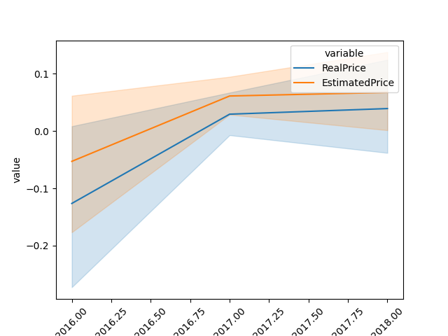
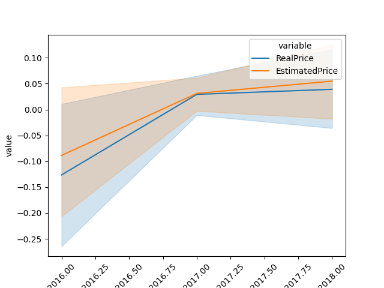
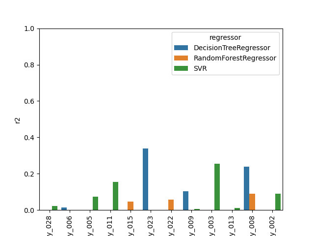
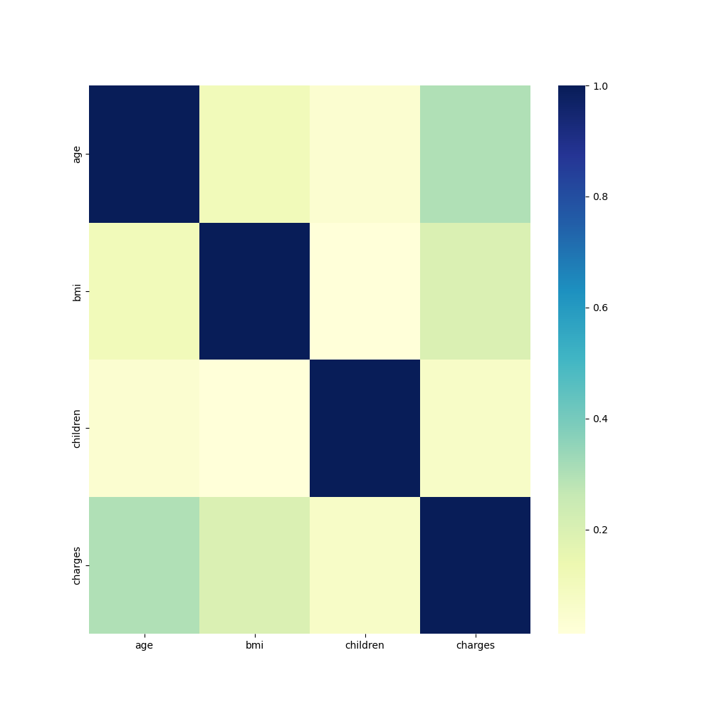
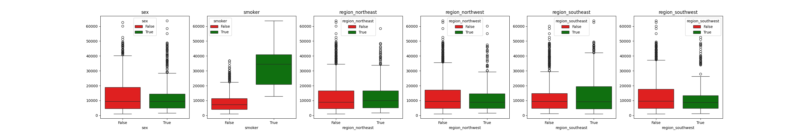
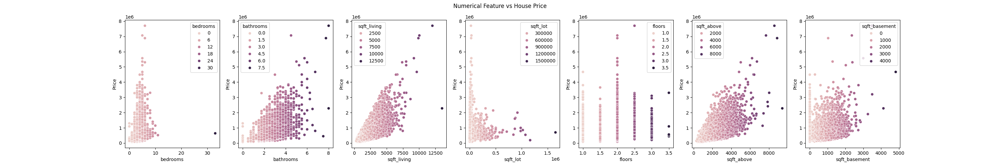
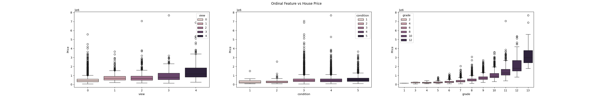
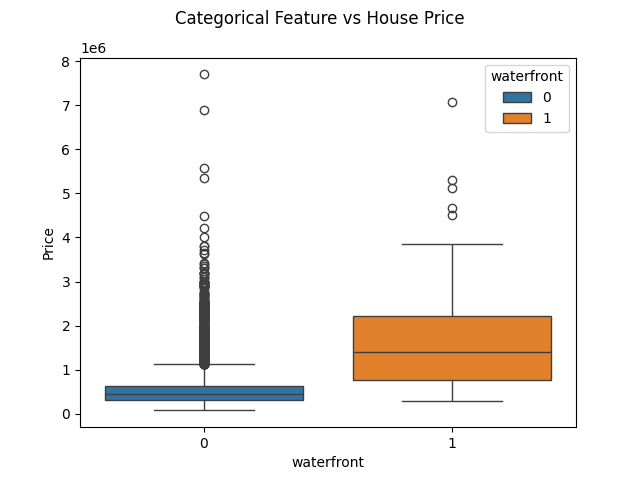

# Data Regression Exercises (Module 4)

### Module_4_Project_1, Predict Avocado Price

### Module_4_Project_2, Product Demand Forecast

### Module_4_Project_3, Predict how much health insurance premiums cost using different regression models

### Module_4_Project_4, Prediction of Housing Proces

