# 🧠 Machine Learning Portfolio

This repo collects machine learning solutions to a variety of problems. I keep it as a reference for myself and I'm happy if anybody else also finds it helpful.

## 📖 Table of Contents
- [🐍 M1_Python](M1_Python/)
- [📊 M2_DataAnalysis](M2_DataAnalysis)
- [🎯 M3_Classification](M3_Classification/)
- [📈 M4_Regression](M4_Regression/)
- [🎨 M5_Clustering](M5_Clustering/)
- [🎬 M6_Recommender_Systems](M6_Recommender_Systems/)
- [🧠 M7_ANN](M7_ANN/)
- [🖼️ M8_CNN](M8_CNN/)
- [🔄 M8_RNN](M8_RNN/)
- [🤖 M9_LLM](M9_LLM/)
- [🔍 Interpretable_ML](Interpretable_ML/)


## 🚀 Getting Started
### Prerequisites
- Python 3.10 or 3.11
- Poetry (for dependency management)
### Installation
```bash
# Clone the repository
git clone https://github.com/your-username/ML_Projects.git
cd ML_Projects

# Install dependencies using Poetry
poetry install

# Activate the virtual environment
poetry shell

# Start Jupyter Lab
jupyter lab
```

## 📚 Module Descriptions

### 🐍 M1_Python
**Foundation Projects**
- Bank Account Management System
- Interactive Chatbot with ASCII Art
- Rock Paper Scissors Game

### 📊 M2_DataAnalysis
**Data Analysis & Visualization**
- Chocolate Quality Analysis
- Football Statistics Analysis
- Breast Cancer Data Exploration
- Banking Customer Analysis

### 🎯 M3_Classification
**Classification Algorithms**
- Decision Trees, Random Forest
- Support Vector Machines (SVM)
- K-Nearest Neighbors (KNN)
- Naive Bayes, Logistic Regression
- Ensemble Methods (AdaBoost, Gradient Boosting, XGBoost)

### 📈 M4_Regression
**Regression Models**

#### 🥑 Avocado Price Prediction
Predicting avocado prices using various regression techniques including KNN and XGBoost.

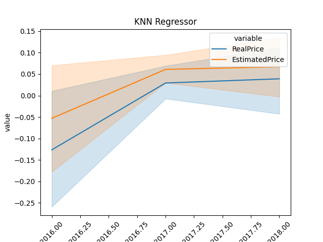
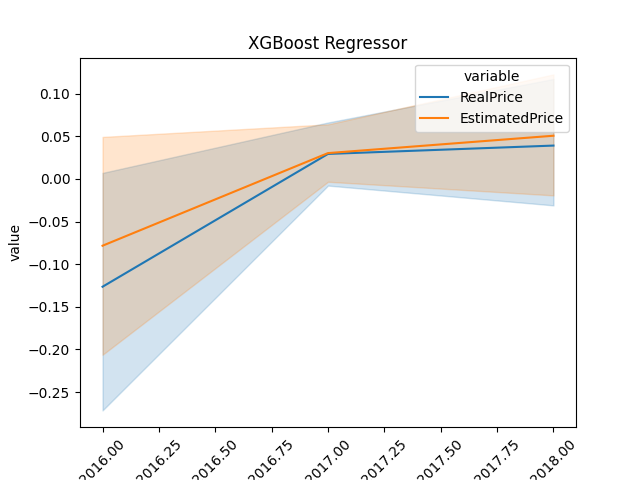

#### 📦 Product Demand Forecasting
Forecasting product demand across different categories and individual products.


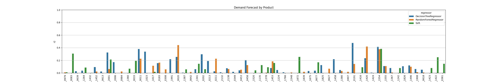

#### 🏥 Health Insurance Premium Prediction
Predicting insurance costs using multiple regression models with comprehensive feature analysis.

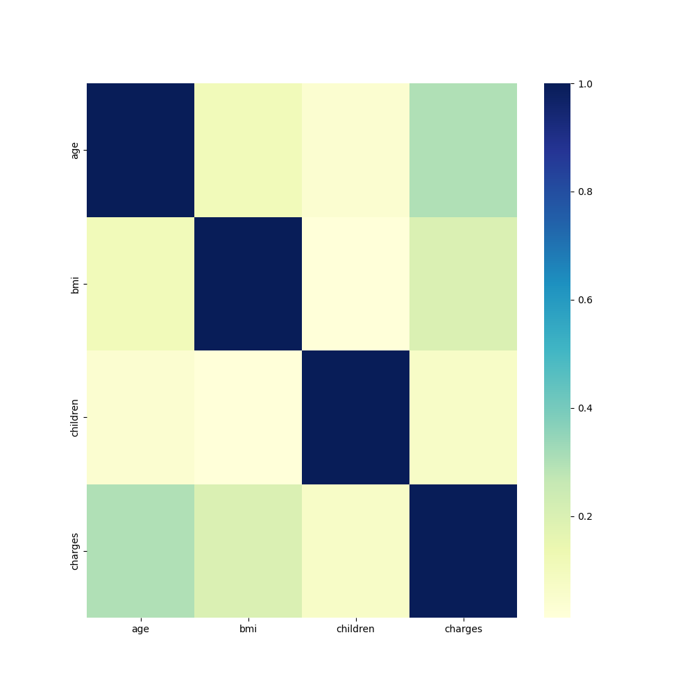
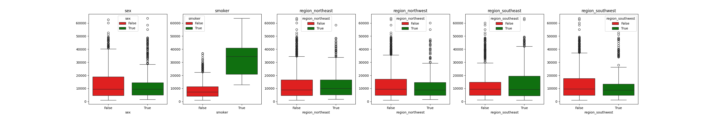
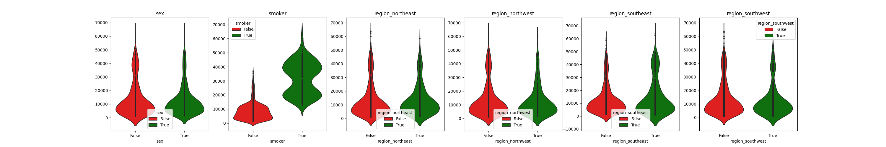

#### 🏠 Housing Price Prediction
Comprehensive housing price prediction with detailed feature analysis.

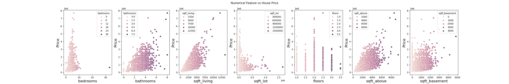
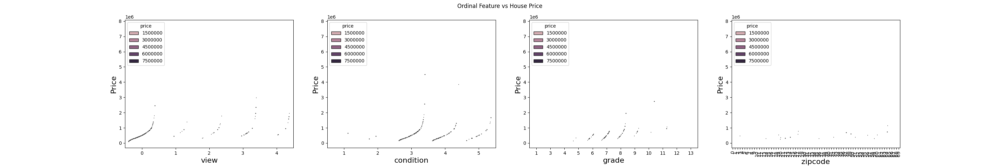
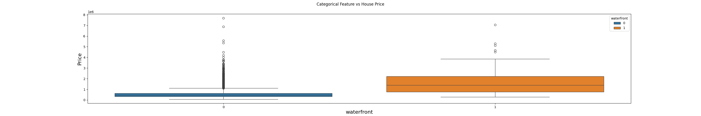
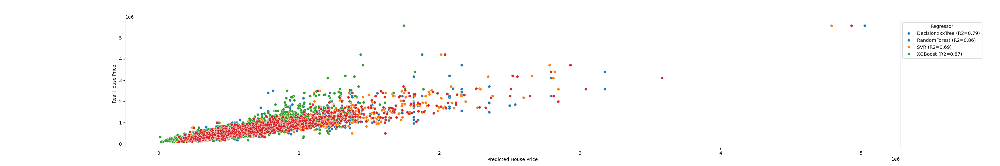

### 🎨 M5_Clustering
**Clustering Techniques**

#### 🖼️ Image Segmentation
Image segmentation using K-Means and Mean-Shift clustering algorithms.


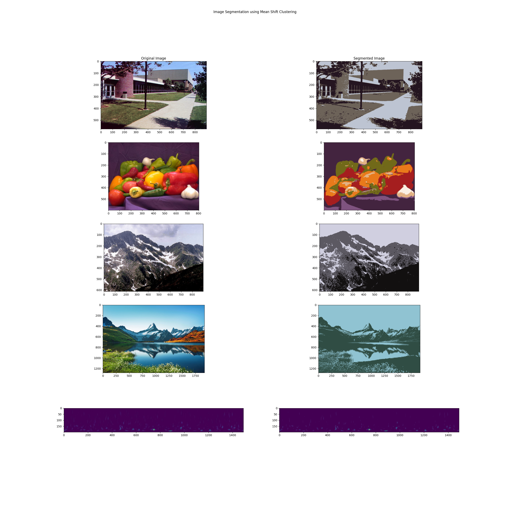

#### 🧠 ScalpEEG Brain Heatmaps
**Clustering-Based Analysis of High-Frequency Oscillations**

Generation of Heatmaps using K-Means clustering for brain template segmentation and HFO activity visualization across developmental age groups.

**Key Features:**
- **Brain Template Segmentation**: K-Means clustering (k=4) for automatic removal of anatomical folds
- **Region Parcellation**: K-Means clustering (k=5) for anatomical lobe definition
- **HFO Activity Mapping**: Visualization of neural oscillation patterns across brain regions
- **Developmental Analysis**: Comparative study across 5 age groups (1 month - 17 years)
- **Interactive Visualization**: Animated heatmaps showing temporal changes


### 🎬 M6_Recommender_Systems
**Recommendation Algorithms**
- Collaborative Filtering
- Content-Based Filtering
- Hybrid Recommendation Systems

### 🧠 M7_ANN
**Artificial Neural Networks**
- Classification Networks
- Regression Networks
- Multi-layer Perceptrons

### 🖼️ M8_CNN
**Convolutional Neural Networks**
- Art Classification
- Cat vs Dog Classification
- CIFAR-100 Image Classification
- Fashion-MNIST Classification
- Fruit Classification
- MNIST Digit Recognition
- Sign Language Recognition

### 🔄 M8_RNN
**Recurrent Neural Networks**
- LSTM for IMDB Movie Review Sentiment Analysis
- Shakespeare Sonnet Generation
- Tweet Sentiment Analysis

### 🤖 M9_LLM
**Large Language Models & Transformers**
- BERT-based Semantic Search Engine
- Shakespeare Text Analysis
- Emotion Text Classification
- Advanced NLP Techniques

### 🔍 Interpretable_ML
**Model Interpretability**
- SHAP Values for Classification
- SHAP Values for Regression
- Breast Cancer Data Interpretability
- 

## 🛠️ Technologies Used

- **Core**: Python 3.10+, Jupyter Lab
- **Data Science**: Pandas, NumPy, Scikit-learn
- **Visualization**: Matplotlib, Seaborn
- **Machine Learning**: Scikit-learn, Imbalanced-learn, Optuna
- **Deep Learning**: TensorFlow 2.15, PyTorch
- **Large Language Models**: 🤗 Transformers, BERT, GPT models
- **Interpretability**: SHAP
- **Development**: Poetry, Git


