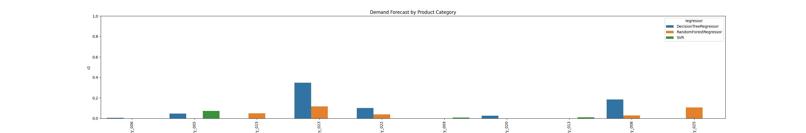

# Portfolio of Machine Learning Projects
 
 
# Regression Examples:

### Module_4_Project_1, Predict Avocado Price

 
 
 
 

### Module_4_Project_2, Product Demand Forecast

 
 
 
 

### Module_4_Project_3, Predict how much health insurance premiums cost using different regression models

 
 
 
 

### Module_4_Project_4, Prediction of Housing Proces

